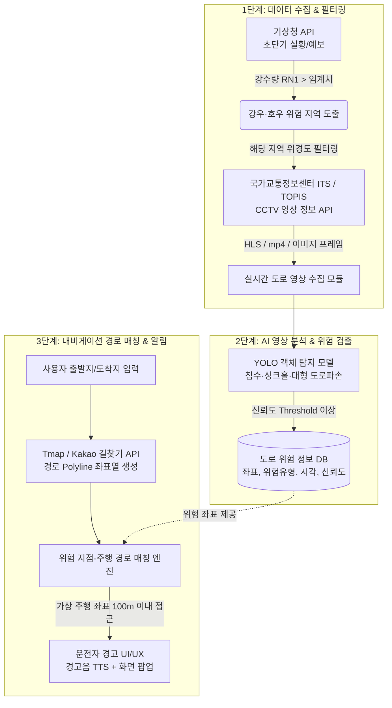

# [캡스톤 디자인] 실시간 기상-CCTV 연계 도로 위험(침수·포트홀) 감지 및 내비게이션 알림 시스템

---

## 📌 1. 프로젝트 개요

* **프로젝트명:** 실시간 기상 데이터 및 도로 CCTV 영상 분석 기반 도로 위험(침수·대형 파손) 감지 및 경로 기반 운전자 경고 시스템
* **수행 목적:**
  * 집중호우 및 악천후 시 급증하는 도로 침수, 싱크홀, 대형 포트홀로 인한 차량 파손 및 2차 교통사고 예방
  * 한정된 공공 인프라 연산 자원을 효율화하기 위해 **기상 데이터 기반 필터링 $\rightarrow$ 위험 지역 CCTV 선별 추론 $\rightarrow$ 사용자 경로 기반 정밀 알림**으로 이어지는 효율적 파이프라인 구축
* **핵심 가치:**
  * **자원 최적화:** 전국 CCTV를 상시 전수 분석하지 않고, 강우/특보 지역에 한해 동적으로 스트림을 분석하여 서버 부하 및 API 비용 최소화
  * **현실적 실증성:** 상용 내비 앱을 직접 수정할 수 없는 한계를 극복하고, Polyline 기반 가상 주행 시뮬레이터 및 웹 기반 경고 시스템(HUD/Audio)으로 완성도 높은 PoC 시연 제공

---

## 🏗️ 2. 시스템 아키텍처 & 파이프라인

### 2.1 전체 데이터 파이프라인 흐름도



---

## 🔌 3. 사용 외부 API 상세 명세

| 구분 | 대상 서비스 | 제공처 | 주요 활용 데이터 및 엔드포인트 | 비고 / 쿼터 |
| :--- | :--- | :--- | :--- | :--- |
| **기상 데이터** | 초단기실황조회<br>초단기예보 | 기상청 API허브 /<br>공공데이터포털 | - 1시간 강수량 (`RN1`)<br>- 강수형태 (`PTY`)<br>- 10분~1시간 단위 주기적 갱신 | 공공 무료 API<br>(일일 트래픽 넉넉함) |
| **도로 영상** | CCTV 영상 정보<br>Open API | 국가교통정보센터(ITS)<br>서울시 TOPIS | - 주요 국도 및 고속도로 CCTV 위·경도<br>- 실시간 스트리밍 URL (HLS/mp4) 또는 정지영상 스냅샷 | 무료 인증키 발급<br>(실시간 스트림 URL 반환) |
| **경로/지도** | 길찾기 API<br>(Directions) | Tmap Mobility API /<br>Kakao Mobility API | - 출발지~도착지 간 최적 경로 Polyline<br>- 경로 상세 노드(위·경도 리스트) 및 도로 링크 정보 | 무료 개발자 쿼터 제공<br>(일 수천~수만 건) |

---

## 🛡️ 4. 기술적 한계 및 심사위원 방어 전략 (Defense Logic)

### ① CCTV 해상도 및 촬영 각도의 물리적 한계
* **병목 현상:**
  * 공공 CCTV는 교통량 관제 목적으로 높은 곳에서 넓은 화각으로 촬영되므로, 저해상도 환경 및 우천 시 노면의 미세 포트홀(지름 수십 cm) 식별이 어려움.
* **해결 및 방어 논리:**
  1. **현실적 타깃 재정의:** 검출 대상을 "미세 포트홀"에 국한하지 않고, 시각적으로 명확히 판별 가능한 **"대형 노면 파손, 싱크홀, 도로 침수(대형 물웅덩이/수막 형성)"**로 확장 정의.
  2. **확장 가능한 파이프라인 어필:** *"본 시스템의 핵심 가치는 감지 알고리즘 자체뿐만 아니라 관제 파이프라인 구조에 있습니다. 향후 지자체의 4K 고화질 스마트 노면 감시 카메라 및 버스·택시 대중교통 블랙박스 엣지 디바이스 연동 관제망으로 즉시 전환 가능한 범용 아키텍처입니다."*

### ② 상용 내비게이션(Tmap/카카오내비) 내부 엔진 접근 불가
* **병목 현상:**
  * 상용 내비 앱(Tmap, 카카오내비)의 음성 안내 엔진이나 지도 UI 내부 코드는 외부 서드파티가 수정/커스텀할 수 없음.
* **해결 및 방어 논리:**
  1. **Polyline 기반 자체 경고 엔진 구현:** Tmap/Kakao의 **길찾기 API**로 경로 상의 연속 좌표 배열(Polyline)을 획득.
  2. **지오펜싱(Geo-fencing) 알고리즘:** 사용자의 현재 주행 좌표(GPS 또는 가상 주행 시뮬레이터 좌표)와 위험 지점 좌표 간 유클리디안/하버사인 거리를 연산.
  3. **브라우저 기반 HUD/내비 프로토타입:** 잔여 거리가 **100m 이하**로 좁혀질 시, 브라우저 화면에 붉은색 경고 UI 팝업 및 Web Speech API(TTS)로 *"전방 100미터 앞 도로 침수 구역입니다. 감속하십시오."* 음성 안내를 시연.

### ③ API 트래픽 및 AI 연산 부하 최적화
* **병목 현상:**
  * 전국의 수천 개 CCTV를 24시간 실시간으로 AI 추론 서버에 투입할 경우 막대한 네트워크 트래픽과 GPU 연산 비용 발생.
* **해결 및 방어 논리:**
  * **3단계 동적 트리거링(Event-driven Triggering):**
    $$\text{기상청 호우 감지} \xrightarrow{\text{필터링}} \text{해당 시·군·구 CCTV 추출} \xrightarrow{\text{주기적 추론}} \text{위험 DB 반영}$$
  * 평시에는 CCTV 영상을 긁어오지 않고 대기하다가, 기상청 API에서 특정 행정구역의 시간당 강수량이 기준치(예: 10mm/h)를 초과할 때만 해당 권역 CCTV를 배치(Batch) 추론하여 **연산 자원을 90% 이상 절감**.

---

## 🎯 5. 캡스톤 최종 구현 범위 (PoC 시나리오)

```
[시나리오 흐름]
1. 관제 대시보드 구동
   └> 기상청 API Polling: 특정 지역(예: 서울 강남구 또는 특정 고속도로 구간) 강수량 모니터링
2. 위험 지역 CCTV 영상 수급
   └> 해당 지역 CCTV 스트림(2~3개 지점) 추출 후 OpenCV 프레임 디코딩
3. AI 모델 추론
   └> 사전 학습된 YOLOv8 모델로 침수 구역 / 도로 파손 바운딩 박스 검출
   └> 신뢰도(Confidence > 0.7) 만족 시 위·경도 좌표와 함께 서버 DB 저장
4. 운전자 내비게이션 웹 시뮬레이션
   └> 사용자 출발지-도착지 설정 (위험 구역을 지나가는 경로 자동 생성)
   └> 가상 주행(시뮬레이션 모드) 시작
   └> 위험 지점 100m 전방 도달 시: 삐- 소리 비프음 + TTS 음성 경고 + 화면 팝업 표출
```

---

## 💻 6. 추천 기술 스택 (Tech Stack)

* **Backend / Pipeline:**
  * `Python 3.10+`, `FastAPI` (비동기 API 및 실시간 스트림 처리)
  * `OpenCV` (CCTV HLS/RTSP 스트림 프레임 캡처)
  * `APScheduler` (기상청 API 주기적 배치 수집)
* **AI / Deep Learning:**
  * `Ultralytics YOLOv8 / YOLOv11` (도로 침수 및 도로 파손 객체 탐지)
  * AIHub '도로 노면 상태 파손 데이터' 또는 Roboflow 침수/포트홀 공개 데이터셋 활용
* **Database:**
  * `PostgreSQL` + `PostGIS` 또는 경량 `SQLite` (위험 지점 위·경도 좌표 공간 쿼리)
* **Frontend / Navigation Client:**
  * `React` 또는 바닐라 `HTML5 / JavaScript`
  * `Kakao Maps SDK` 또는 `Leaflet.js` (지도 상 Polyline 경로 및 위험 마커 렌더링)
  * `Web Speech API` (브라우저 내장 TTS 음성 안내)

---

## 📅 7. 개발 추진 마일스톤

| 단계 | 기간 | 주요 개발 내용 | 산출물 |
| :---: | :---: | :--- | :--- |
| **Phase 1** | 1~2주차 | • 기상청 초단기실황 API & ITS CCTV API 키 발급 및 연동 테스트<br>• CCTV 스트림 캡처 파이프라인 스크립트 작성 | API 연동 테스트 코드 |
| **Phase 2** | 3~4주차 | • 도로 침수 및 노면 파손 데이터셋 수집 및 라벨링 정비<br>• YOLO 모델 파인튜닝(Fine-tuning) 및 검출 성능 평가 | 학습 완료된 AI 가중치 (.pt) |
| **Phase 3** | 5~6주차 | • FastAPI 기반 백엔드 파이프라인 구축 (기상 $\rightarrow$ CCTV $\rightarrow$ AI $\rightarrow$ DB)<br>• Tmap/Kakao 길찾기 API 연동 및 경로 생성 | 통합 백엔드 서버 |
| **Phase 4** | 7~8주차 | • 웹 기반 내비게이션 지도 UI 개발<br>• 가상 주행 경로 시뮬레이터 및 거리 기반 TTS 경고 시스템 구현<br>• 최종 시연 및 발표 자료 제작 | 웹 데모 애플리케이션 & 발표 자료 |
